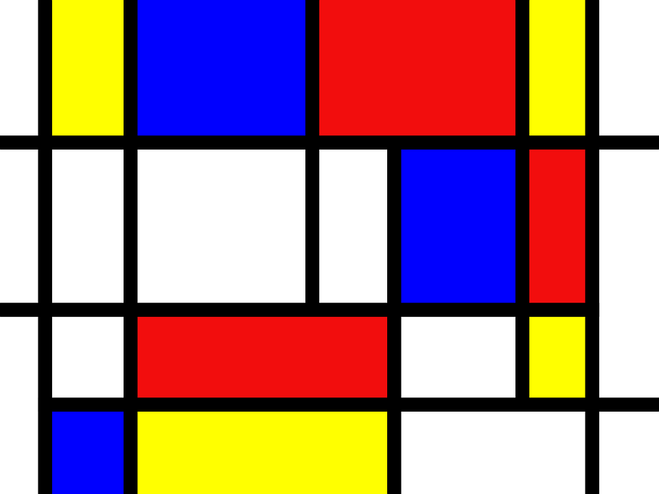

# Cuaderno 1 

Este Cuaderno muestra el desarrollo del primer cuaderno de la asignatura, el cual incluye 6 ejercicios.

### Pasos Previos

Antes de si quieras empezar hay que seccionarte de tener disponible 2 apartados fundamentales:

* Una Cámara funcional ya sea incluida con el portatil o que se conecte al propio ordenador
* Un entorno virtual creado con Python, opencv-python y matplotlib instalado (En este cuaderno se utilizará Anaconda)

### Desarrollo

Para empezar dentro de nuestro cuadernos tendremos unas librerías instaladas:

```python
import cv2  
import numpy as np
import matplotlib.pyplot as plt
```
 
* **OpenCV (cv2)**: Se utiliza para la captura y procesamiento de imágenes y video en tiempo real. En el cuaderno se usará para capturar videos de la cámara web y añadir figuras sobre fotogramas. Es la librería principal de tratamiento de Fotogramas

* **NumPy (np)**: Proporciona estructuras de datos eficientes. En el cuaderno se usa para manipular datos de las imágenes y es una opción para crear un collage.

* **Matplotlib (plt)**: Se usa para la visualización de imágenes en gráficos y ventanas. Lo utilizaremos para enseñar imágenes procesadas, aunque no es indispensable para los ejercicios que incluyan la cámara en tiempo real.

Una vez están esas librerías instaladas, se puede empezar por las propias tareas

#### Tarea 1 - Crear un tablero de ajedrez 

Se nos pide crear una imagen de 800x800 que se vizualize que parezca un tablero de ajedrez formando un patrón en el que hay un 4 casillas negras y 4 blancas de igual tamaño por cualquier fila o columna de la imagen.

Para ello la resolucion viene dada por algo bastante simple

1. Primero se crea una imagen con las medidas totalmente negra
2. Luego crearemos un doble for que vaya de 0 a 1000 de 200 en 200 en ambos bucles y que cree un reacuadro blanco de 100x100 en todos sus espacios, esto deja algo cerca a lo buscado pero exacto

<div align="center">
    
</div>

3. Por ultimo, utilizaremos los mismo bucles pero esta vez empezando en 100 en vez de 0, lo cual rellena los ultimos huecos

<div align="center">
    
</div>

#### Tarea 2 - Crear un arte estilo Modrian

Aqui se pide recrear la imagen propuesta 

<div align="center">
    
</div>

Para la realización de este ejercicio simplemente creamos varios comandos de uno en uno replicando poco a poco la imagen, una forma más simple en la practica sería encontrar un patrón con la que replicar la imagen, pero podría acabar siendo más complicado que simplemente poner los comandos. Este es el resultado.

<div align="center">
    
</div>


#### Tarea 3 - Repetir o la tarea 1 o la tarea 2 pero con OpenCV

Esta tarea no requiere mucha explicación. Se ha elegido hacer el tablero de ajedrez de nuevo. Sabiendo esto no hay mucho que descubrir nuevo, es exactamente la misma solución pero con dos diferencias. 

* La primera y menos importantes es que en vez de utilizar dos combinaciones de dobles bucles for, utilizamos un doble for pero que tiene dos comandos haciendo todo el tablero de golpe y sin la necesidad de crear una tablero incial

* Y la segunda diferencia es que el comando para crear el recuadro blanco se hace con OpenCV.

```python
# Tarea 1 realizado de forma normal sobre la librería np

tablero[i:(i + 100), j:(j + 100), 0] = 255

# Tarea 3 realizado con OpenCV

cv2.rectangle(tableroCV, (i, j), ((i + 100), (j + 100)), (255, 255, 255), -1)
```

Esto solo es unaa pequeña muestra del codigo que genera los recuadros blancos. Importante remarcar que la i y la j son de los propios bucles For

#### Tarea 4 - Modificar de forma libre los valores de un plano de la imagen

Se utilizará la imagen proporcionada para realizar los cambios, tendremos dos ejemplos puesto, uno muestra la imagen de forma normal mientras que el segundo ejemplo fuerza la lectura de grises

Ahora toca hablar de los ejemplos de modificaciones propuestas, se han añadido 2 modificaciones.

* Primero tendremos los dos ejemplos puestos por el profesor

* Luego haremos la primera modificación original que será un aumento de la intensidad del canal rojo en la imagen original, simplemente tomaremos el valor actual del canal rojo y lo multiplicaremos por 10, dejandolo en un tono violeta como resultado  

<div align="center">
    
</div>

* Por ultimo, tendremos otra modificación que será igual con una modificación del canal rojo. La parte interesante de este es que se hará sobre un rectangulo designado en todo el medio de la imagen, mientras que el resto de la imagen se queda intacto

<div align="center">
    
</div>

#### Tarea 5 - Pintar círculos en las posiciones del píxel más claro y oscuro de la imagen

Para esta tarea necesitaremos la cámara antes mencioanada, donde será necesario ponerla a ver ya sea un paisaje o nuestra propia cara. Para esto seguiremos una simple estructura 

```python
vid = cv2.VideoCapture(0)

while(True):      
    ret, frame = vid.read()

    if ret:
        cv2.imshow('Vid', frame)

    if cv2.waitKey(20) == 27:
        break

vid.release()
cv2.destroyAllWindows()
```
Esta pequeña estructura monstrara todo lo que puede recoger la cámara. Y podemos utilizar la sección "if ret:" para poder modificar las imagenes ya que el ret indica que si es True, el programa continúa. Si es False, significa que no hay fotograma y no hace nada en este ciclo.

Luego de eso podemos diferenciar el añadido para realizar este ejercicio en 3 partes

1. Convertir el fotograma a escala de grises para simplificar el cálculo de brillo (Esto se hace principalmente para que los FPS seán más consistentes)

2. Utilizar el comando "minMaxLoc" para conseguir las (X, Y) de los puntos más claros y oscuros del frame actual 

3. Por ultimo usar OpenCV para dibujar unos circulos sobre dichos pixeles. IMPORTANTE Destacar que se utiliza el color Rojo para el punto más claro y el verde para el más oscuro

#### Tarea 6 - Llevar a cabo una propuesta propia de pop art

LLegamos a la ultima tarea la cual propone una hacer un pop art de cualquier manera deseada. 

Para esto he decido crear algo simple, mi cámara replicada 3 veces en la misma cámara. La primera replica es normal, la segunda es algo negativa, y la tercera esta totalmente en los colores negativos

Vamos a partir de la sección anterior donde tenemos el codigo minimo para ver nuestra cámara, a partir de ahí tendremos neuvamente 3 secciones aunque esta vez mucho más largas.

1. La primera parte será fuera de nuestro bucle ret, donde alteraremos la cámara para dividirse en tres secciones haciendo un collage. Para ello primero necesitaremos las medidas de nuestra cámara y alterarlas

```python
# Dimensiones de la cámara
w = int((vid.get(cv2.CAP_PROP_FRAME_WIDTH) * 2) / 3)
h = int(vid.get(cv2.CAP_PROP_FRAME_HEIGHT) / 2)
vid.set(cv2.CAP_PROP_FRAME_WIDTH, w * 3)
vid.set(cv2.CAP_PROP_FRAME_HEIGHT, h)
```

Cabe decir, muchos de los números por los que se multiplica los valores de la altura o el ancho son sacados a pura prueba y error, lo que quede mejor

2. Luego con las medidas, creariamos un collage que será con el que trabajaremos, además de una secciones separadas para poder trabajar de manera independientes

```python
# Creamos una imagen en forma de línea horizontal con 3 secciones
collage = np.zeros((h, w * 3, 3), dtype=np.uint8)

sec1 = collage[:, 0:w]
sec2 = collage[:, w:2*w]
sec3 = collage[:, 2*w:3*w]
```
3. Por ultimo, dentro ya del bucle ret, utilizaremos las secciones creadas anteriormente para alterar sus canales, haciendo uno normal, otro parcialmente negativo y un ultimo totalmente negativo

 ```python
 frame = cv2.resize(frameIN, (w, h), cv2.INTER_NEAREST)

 sec1[:, :, :] = frame
 sec2[:, :, :] = frame - (255 - frame) //3
 sec3[:, :, :] = 255 - frame

 cv2.imshow('Pop Art - Negativo Progresivo', collage)
```

